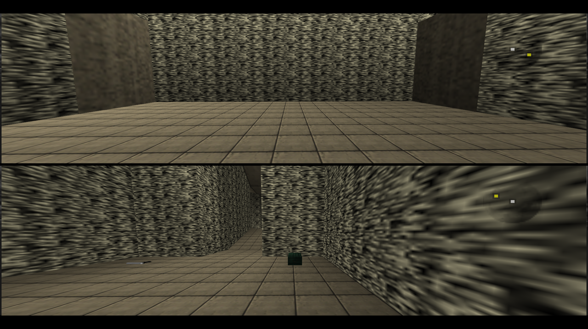

# GoldenEye 007 PC Port

[](https://github.com/jkdansereau/goldeneye-pc-port/actions/workflows/ci.yml)


A native PC port of _GoldenEye 007_ (Rare, 1997, Nintendo 64), compiled from
the [GoldenEye 007 decompilation](https://github.com/n64decomp/007): the
original N64 game running from reconstructed source, not the Xbox 360
remaster. The N64's graphics coprocessor (RSP) is emulated in software; every
other hardware surface (video, audio, input, timers, save storage) is shimmed
in a dedicated `port/` layer, following the architecture of the
[Perfect Dark PC port](https://github.com/fgsfdsfgs/perfect_dark), the same
Rare "Indy" engine family, one hardware generation apart.

**v0.3.0** is out for Windows and Linux (including Steam Deck, where the
Linux bundle sideloads as-is) and runs the full campaign at a steady 60 fps
with known rough edges ([Status](#status)). Free to download, build on and
modify (you bring the ROM).

**This is a pre-1.0 release, not a finished product.** v1.0 is the target
for a polished, feature-complete build; until then, expect rough edges,
missing features, and breaking changes between versions. See
[Status](#status) for what works today and [Roadmap](#roadmap) for where
this is headed.

**AI disclosure:** development here was agentic - Claude Pro plus a local
open-weight model on a single RTX 5090, as of August–September 2026. This
project is as much a study of *that process* as it is a port: whether
current LLMs can carry a codebase like this, and what actually goes wrong
along the way. Judge the result for yourself.
I'm one person doing this in my spare time, not a team. See
[Background](#background) for the full setup, timeline, and an honest
account of what worked and what didn't.

> [!IMPORTANT]
> **You must supply your own GoldenEye 007 ROM.** This repository contains no
> Nintendo code or assets, and no ROM. Nothing here is distributable as a
> playable game: see [Requirements](#requirements) and [Legal](#legal).

<p align="center">
  
  <br><em>All in-engine, running in the port — a ~12&nbsp;s gameplay montage
  from live v0.3.0 play sessions.</em>
</p>

## Download

| Platform | Bundle | Notes |
|---|---|---|
| **Windows** (x86_64) | [win64.zip](https://github.com/jkdansereau/goldeneye-pc-port/releases) | Engine + runtime DLLs + the one-time asset tool. |
| **Linux** (x86_64) / **Steam Deck** | [linux tarball](https://github.com/jkdansereau/goldeneye-pc-port/releases) | SDL2 is bundled, so it runs as-is on any distro, and sideloads onto a Deck with nothing installed. |

Both bundles contain **no ROM and no game assets**: you supply your own
(see [Requirements](#requirements)), which keeps the release legal to
distribute. Earlier builds: v0.2.2, v0.2.1, v0.2.0, and v0.1.0 alpha, same
page. You can also build it yourself; see [Building](#building).

### Quick start

You need a GoldenEye 007 N64 ROM (`.z64`, big-endian). This release supports
the **NTSC-U (US)** version; PAL and JP are on the roadmap ([issue
#85](https://github.com/jkdansereau/goldeneye-pc-port/issues/85)). No ROM or game asset is
included or distributed. Then:

1. Download the Windows or Linux bundle from [Releases](https://github.com/jkdansereau/goldeneye-pc-port/releases) and unpack it.
2. Make a `data/` folder next to the executable and drop the ROM in as `ge007.ntsc-final.z64`.
3. Launch the executable from that folder. The first run takes a few extra seconds: it detects the ROM and generates the derived asset folders once (no Python or other tooling needed).

Read the [Status](#status) caveats first: v0.3.0 has known rough edges,
listed plainly there.

## Status

**v0.3.0 - playable, with known rough edges.** The full single-player
campaign is completable end to end (all 20 missions, Agent difficulty,
playtested), at a steady 60 fps; all 20 solo missions — plus the
end-of-campaign credits sequence — load, render and run crash-free, verified
on Windows, Linux and real Steam Deck hardware. Feedback
is very welcome.

What a release actually installs (no networking, no telemetry, no ROM or
game assets shipped) and how faithfully the port tracks the original N64
game's logic: [Security & fidelity status](docs/security-and-fidelity-status.md).

**Working:** boot sequence and front end (menu → mission select → briefing →
start), front-end menu navigation on the left stick to match the F10 overlay
(D282); all 20 solo missions load, render and are crash-free (full campaign
playtested end to end at Agent difficulty, including the ending sequence); steady 60 fps
(software RSP off the presentation critical path); full audio: in-level music and SFX; keyboard + mouse (click-to-lock, proportional aim mode, a single
simplified sensitivity control) and a modern dual-stick controller layout;
automatic widescreen FOV scaling; Bond is fixed in cutscenes (no more
floating or spin-glitching) and his third-person model positioning generally
is right the large majority of the time now, at most a small drift when off; file-backed saves; faithful N64 progression
by default (F10 → *All unlocked* opens every level, 007 mode and the full
cheat menu); F10 in-game options overlay (resolution, frame cap, MSAA,
filtering, FOV, sensitivity); Windows and Linux, including Steam Deck.

### Experimental co-op split screen

The `feature/coop` branch adds two-player co-op with independent spawn
positions and vertically separated, non-overlapping viewports. This is a live
Dam capture from the PC renderer:

<p align="center">
  
  <br><em>Experimental two-player co-op on Dam, with a separate viewpoint for
  each player.</em>
</p>

**Known issues:**

- Particle colours: a real fix landed (a corrupted-vertex-buffer bug), but
  the rainbow effect can still occur intermittently on either platform, not
  every time or on every level — a second cause hasn't been found yet
  (D252).
- Some muzzle flashes draw an extra, erroneous long flash straight up from
  the gun (seen on the M16, among others), overlaid on the normal, correctly
  drawn flash. Cosmetic only (D303).
- Water levels show a moving seam between two water patterns (D245).
- Occasional z-fighting on some levels' geometry (D308) — a Dam intro/
  truck-wheel instance showing odd transparent-looking areas may be related
  (D306). Minor and cosmetic.
- In-level security camera props (not the player's own view) can
  occasionally end up facing backwards on some levels, seen on Bunker
  (D307).
- Rarely, Bond's model can briefly render out of place after an animation
  transition — purely visual: no effect on gameplay or saves, and it clears
  on its own or by re-entering the level (D311).
- On Facility, if gas leaks during Ourumov's monologue he can pause for up to
  ~10 s before resuming the scripted shootout — a latent race that exists in
  the N64 original too (where it softlocks permanently); the port detects and
  auto-recovers it (D318).
- Some front-end 3D models are off: the spinning Nintendo logo renders as two
  white blobs and the Rareware logo's texture filtering looks wrong (D75).
- Surface 1's 2D billboard trees render as a solid wall of tree texture
  instead of discrete sprites (D236). Under active investigation.
- **Widescreen is stretched, not native**: on non-4:3 windows the whole
  frame (world and HUD) is stretched horizontally to fill your display —
  about 33% wider than original at 16:9, like a 4:3 video in a TV's "stretch"
  mode. Automatic FOV scaling keeps the framing comfortable and gameplay is
  completely unaffected (all game logic runs in world space), but shapes are
  subtly wider than on the N64 — most visible on round objects (barrels, the
  radar). A distortion-free native widescreen render is on the roadmap.
- Distant geometry can drop out on the biggest open levels (Streets,
  Egyptian) at default FOV — a culling/LOD issue that sometimes
  self-corrects as you keep moving (D249).
- Gunshot SFX can sound off during sustained/rapid fire: cadence can drift
  from the N64 original's rate, and PP7/AK47 fire can occasionally go silent
  under heavy automatic fire near another looping sound (D240/D241).
- **`All unlocked` is highly experimental — don't enable it until you have
  at least one save written** (complete a level normally first, e.g. Dam on
  Agent). Enabling it on a brand-new install with no prior save can still
  cause silent audio and odd right-mouse-aim behavior (D257/D259/D281).
- Assorted further cosmetic defects are tracked in
  [`docs/dev/GRAPHICS-BACKLOG.md`](docs/dev/GRAPHICS-BACKLOG.md).
- No macOS or ARM support; no controller rebinding UI.

Root causes and fix status for every item: the [release notes](https://github.com/jkdansereau/goldeneye-pc-port/releases)
and the finding log in [`docs/dev/findings.md`](docs/dev/findings.md).

### Steam Deck

The Linux bundle is the Deck build. SFTP it over from your PC, or download
it straight from the [releases page](https://github.com/jkdansereau/goldeneye-pc-port/releases) on the Deck itself:
unzip, drop your ROM in `data/`, launch it once (the first run generates the
derived assets), and add the executable as a non-Steam game. SDL2 is bundled, so no dependencies need
installing. On SteamOS the first launch seeds `ge007.ini` with Deck-friendly
defaults: native 1280×800 fullscreen, VSync, MSAA 4, and 150% draw/LOD
distance (the authored N64 fade distances read short on the close-up panel);
everything is changeable in the options overlay and persists afterwards.
**Do that first launch in Game Mode, not Desktop Mode** — an ini created by
an earlier Desktop Mode launch (e.g. while testing before adding it as a
Steam shortcut) permanently skips the Deck preset, since any existing ini
always wins over it (D283). If your resolution isn't 1280×800 on first
Game Mode boot, just set it manually: F10 → *Resolution*. The renderer is
CPU-bound (software RSP); expect original N64-era
performance at 60 fps rather than more. This release was playtested on real
Deck hardware; the v0.1.0-era Facility crash (D203) did not recur: its root
cause was identified and fixed (D253), and a separate intermittent SIGSEGV
in heavy firefights/terminal destruction (D255) and an audio-thread crash
(D305) are both fixed and live-verified on real hardware as of this release.

**In-game settings on the Deck.** The options overlay is fully gamepad-driven:
it opens with **Select**, the D-pad or left stick (up/down) moves between
options, **A** steps the selected option forward, **B** steps it back, and
**Start** (or Select again) closes. Toggles flip, resolution / MSAA /
filtering cycle, sliders step in increments. With a keyboard attached the same
overlay is `F10` + arrows/Enter.

## Roadmap

No fixed timeline or committed feature list — this is spare-time work — but
directionally, on the way to v1.0:

- Working through the [known issues](#status) above and the fuller list in
  [`docs/dev/findings.md`](docs/dev/findings.md).
- **PAL and JP ROM support** ([issue #85](https://github.com/jkdansereau/goldeneye-pc-port/issues/85)); NTSC-U is the only supported region today.
- **Native widescreen** — a distortion-free render at your display's aspect
  (correct-aspect projection and a wide-frame HUD), replacing today's
  stretched 4:3 frame + FOV compensation.
- **Controller rebinding UI**, and macOS/ARM builds.
- **LAN multiplayer**: reviving GoldenEye's original split-screen/deathmatch
  netplay across multiple PCs on a local network. Genuinely under
  consideration, but early and not started; no ETA.
- General polish: performance, remaining rendering/audio defects, save/config
  robustness.

The experimental co-op implementation shown above is limited to
`feature/coop` and is not part of the v0.3.0 release. Online (non-LAN)
multiplayer and ray tracing are not currently planned. If either matters to
you, open an issue — it helps prioritize.

## Beyond playing

- **Tweak it**: `ge007.ini` and the F10 in-game overlay expose resolution,
  frame cap, MSAA, texture filtering, FOV/draw distance and mouse feel;
  launch with `-fresh` for a clean-slate run.
- **Read it**: [`docs/internals.md`](docs/internals.md) maps the
  architecture and the software RSP; [`docs/porting-notes.md`](docs/porting-notes.md)
  is the catalogue of N64→PC bug classes hit along the way. Game logic in
  `src/` is unmodified decompilation; every hardware surface lives in the
  MIT-licensed `port/` layer.
- **Mod it**: the port layer, build system and `tools_pc/` are yours to
  extend (see [License](#license)); [`CONTRIBUTING.md`](CONTRIBUTING.md) has
  the ground rules for getting changes in, and [`docs/dev/`](docs/dev/) is
  the raw engineering record behind every fix.

## Background

The port was built by two coding agents, a local open-weight model
(`unsloth/Qwen3.8-27B-GGUF` on one RTX 5090, via the [pi](https://pi.dev/)
agent) doing the groundwork (build, boot chain, software-RSP integration,
asset pipeline, first frames), and **Claude Code** (Sonnet 5, Opus 5 for the
hardest bugs) joining for the collaborative phase (the 21-level sweep, the
ABI finding catalog, SDL input, front end), handing work back and forth
through shared written notes, directed by one person part-time. In short:
36 days (16 Aug – 20 Sep), ~835 commits, 199 findings root-caused and
logged (`D1`–`D321`).

The full write-up (timeline, handoff mechanism, effort breakdown, an honest
"what worked / what didn't"): [`docs/dev/agentic-development.md`](docs/dev/agentic-development.md).
The workflow itself: [`docs/dev-process.md`](docs/dev-process.md). To cite the
project or its findings: [`CITATION.cff`](CITATION.cff) (GitHub's "Cite this
repository" menu).

## How this differs from the other GoldenEye PC projects

This is a native port of the original 1997 Nintendo 64 game, built from its
actual reconstructed source code, the same lineage as the Perfect Dark PC
port. The other well-known "GoldenEye on PC" projects are something
different: they machine-translate the shipped binary of the *unreleased Xbox
360 XBLA remaster*, a different game on a different codebase with no shared
code with this one.

| | This project | The other well-known "GoldenEye on PC" recompilation projects (and their Steam Deck builds) |
|---|---|---|
| **What it ports** | The original **Nintendo 64** game (1997) | The **Xbox 360 XBLA** HD remaster (built ~2007, never released) |
| **How** | Decompilation-based source port: human-reconstructed C, compiled for the host; game logic runs as written | Static binary recompilation: the shipped machine code is auto-translated to C; no source-level understanding |
| **Lineage** | [GoldenEye 007 decompilation](https://github.com/n64decomp/007) + [Perfect Dark PC port](https://github.com/fgsfdsfgs/perfect_dark) engine family | Xbox 360 "…Recompiled" static-recompilation family |
| **Renderer** | Software RSP → OpenGL | Hardware (Vulkan) |
| **Status** | v0.3.0 public release; full campaign playable at 60 fps (see [Status](#status)) | Playable full game |
| **Why it exists** | To run the *original* N64 game from source, and as a [case study in AI-agent collaboration](#background) on a hard low-level codebase | To get a playable PC release of the remaster |

They answer a different question: how to get the *remaster* onto PC by
machine translation. This project answers how to get the *original 1997
game* onto PC, running from its reconstructed source.

## Requirements

You need a GoldenEye 007 (Nintendo 64) ROM that you legally own, in
big-endian (`.z64`) format, matching one of:

| Region | ROMID | ROM filename (in `data/`) | SHA-1 |
|--------|-------|---------------------------|-------|
| NTSC-U (US)  | `ntsc-final` | `ge007.ntsc-final.z64` | `abe01e4aeb033b6c0836819f549c791b26cfde83` |
| PAL (EU)     | `pal-final`  | `ge007.pal-final.z64`  | `167c3c433dec1f1eb921736f7d53fac8cb45ee31` |
| NTSC-J (JP)  | `jpn-final`  | `ge007.jpn-final.z64`  | `2a5dade32f7fad6c73c659d2026994632c1b3174` |

This release supports the US (NTSC-U) version; PAL and JP ROMs are
recognised by region but not yet supported (on the roadmap, [issue
#85](https://github.com/jkdansereau/goldeneye-pc-port/issues/85)).

The port also relies on the decompilation's asset-extraction step, which pulls
the level, model, texture and music data out of your ROM at build time. That
step, too, requires your ROM and is part of [Building](#building).

## Building

Prerequisites: CMake >= 3.16, a C/C++ toolchain, SDL2, zlib, OpenGL, Python 3,
plus the decompilation's own build dependencies (an IRIX MIPS toolchain via
`qemu-irix`, used only for the one-time asset extraction). See
[`docs/building.md`](docs/building.md) for the full walkthrough and the
asset-extraction details.

### Windows (MSYS2)

```sh
# in the MINGW64 shell
pacman -S mingw-w64-x86_64-toolchain mingw-w64-x86_64-SDL2 \
          mingw-w64-x86_64-zlib mingw-w64-x86_64-cmake \
          mingw-w64-x86_64-python make git

git clone https://github.com/jkdansereau/goldeneye-pc-port.git
cd goldeneye-pc-port
# 1. extract assets from your ROM (see docs/building.md)
# 2. build the port
./build-pc.sh ntsc-final         # NTSC-U; PAL/JP engine builds compile, but their asset sidecars are not yet producible (issue #85)
```

### Linux

The Linux build is compiled on every push by CI (ubuntu-24.04); the release
bundle additionally bundles SDL2 so no system packages are needed at runtime.

```sh
sudo apt install build-essential cmake python3 libsdl2-dev zlib1g-dev libgl1-mesa-dev
git clone https://github.com/jkdansereau/goldeneye-pc-port.git
cd goldeneye-pc-port
# extract assets (docs/building.md), then:
./build-pc.sh ntsc-final
```

The executable is written to `build-pc/ge007.x86_64` (on Windows,
`build-pc/ge007.x86_64.exe`).

## Running

1. Create a `data/` directory in the repo root.
2. Put your ROM in it, named as in the table above
   (e.g. `data/ge007.ntsc-final.z64`).
3. Run the executable from the repo root:
   `./build-pc/ge007.x86_64`.

Configuration is written to `ge007.ini` on first run; game progress
lives in `ge007.eep`. Launch with `-fresh` to wipe both before starting
(a clean-slate run for playtesting).

### Default controls

| Action              | Keyboard / mouse         | Controller    |
|---------------------|--------------------------|---------------|
| Move / strafe       | `W` `A` `S` `D` / arrows  | Left stick (or D-pad) |
| Aim / look          | Mouse                    | Right stick   |
| Fire (Z)            | Left mouse / `LCtrl`     | Right trigger |
| Aim mode (R)        | Right mouse / `LShift`   | Left trigger  |
| Use / accept (A)    | `Space` / `E` / `X`      | A / X         |
| Reload / cancel (B) | `R` / `F`                | B / Y         |
| Next weapon         | Mouse wheel up           | RB            |
| Previous weapon     | Mouse wheel down         | LB            |
| Start               | `Enter` / `Tab`          | Start         |
| Options overlay     | `F10`                    | Select (D-pad/stick + A/B navigate, Start closes) |

The controller layout follows the modern dual-stick scheme used by the
console re-releases (left stick move, right stick look, triggers fire/aim,
shoulders cycle weapons).

Mouse sensitivity, Y-inversion and the aim/turn split are tunable in the
`[Input]` section of `ge007.ini`.

## How it works

The R4300 game code in `src/` is compiled completely unmodified; the
decompilation's control flow is ground truth. Everything that would touch N64
hardware is redirected into `port/`: a **software RSP** (`port/fast3d/`,
adapted from the Perfect Dark port) that interprets the GBI display list the
game builds each frame and emits OpenGL, bypassing the RDP; a scheduler
replacement (`port/src/gesched.c`) that drives it directly; single-threaded
libultra OS shims (`port/src/libultra.c`); and SDL2/OpenGL/filesystem backends
for video, audio, input and storage. The 32→64-bit transition forces a small,
cataloged class of mechanical ABI-only edits to ROM-serialized structs
(pointer-width reconciliation); these change no behavior and are documented
individually. Where it diverges from the Perfect Dark port: GoldenEye's N64
serialized asset formats are converted offline by Python "sidecar" converters
in `tools_pc/` rather than fixed up at load time. Full detail:
[`docs/internals.md`](docs/internals.md) and
[`docs/porting-notes.md`](docs/porting-notes.md).

```
CMakeLists.txt      PC build (parallel to the decomp's Makefile, which is untouched)
build-pc.sh         configure + build helper
src/  include/      the decompilation (game + libultra) - compiled unmodified
port/
  fast3d/           software RSP -> OpenGL
  src/              port layer (main, OS shims, video, audio, input, fs, ...)
  include/          port-facing headers
tools/  Makefile    the N64 build + asset extraction (from the decomp; do not modify)
tools_pc/           PC-port helper + analysis scripts
docs/               see below
```

## Documentation

Key docs are also published as a site:
<https://jkdansereau.github.io/goldeneye-pc-port/>.

| Doc | What's in it |
|---|---|
| [`docs/building.md`](docs/building.md) | Full build + asset-extraction guide. |
| [`docs/internals.md`](docs/internals.md) | Architecture, the RSP-emulation approach, GE-vs-PD engine differences, the phased plan. |
| [`docs/porting-notes.md`](docs/porting-notes.md) | The recurring N64→PC bug classes hit during the port, with fixes. |
| [`docs/dev/agentic-development.md`](docs/dev/agentic-development.md) | The research angle: the two-agent setup, timeline, handoff workflow, and an assessment of what did and didn't work. |
| [`docs/dev-process.md`](docs/dev-process.md) | The investigation workflow in detail: budgets, file partitioning, the finding-log discipline. |
| [`docs/dev/`](docs/dev/) | The raw engineering record: the full finding log, per-level status, graphics backlog, playtest matrices, and [`docs/dev/game-behavior-reference.md`](docs/dev/game-behavior-reference.md) (a secondary-sourced playtest reference for how the retail game is meant to behave; repo-only, code is ground truth). |
| [`docs/SetupGuide.md`](docs/SetupGuide.md), [`docs/StyleGuide.md`](docs/StyleGuide.md) | Inherited from the decompilation this repo forks. |

## Credits

This port is a thin layer on a large amount of other people's work.

**Prior work it is built on**

- The [GoldenEye 007 decompilation](https://github.com/n64decomp/007), years of
  effort by Larry Ficken ("kholdfuzion") and the project's contributors; plus
  zoinkity's GoldenEye documentation, which the decomp started from. This port
  is a fork of that repository.
- The [Perfect Dark PC port](https://github.com/fgsfdsfgs/perfect_dark)
  (Ryan Dwyer and contributors), the reference architecture for this port and
  the source of the `fast3d` software RSP.
- The [Perfect Dark decompilation](https://github.com/n64decomp/perfect_dark),
  the sibling decomp the PD port is built on.
- **Carnivorous**: author of the *Mouse Injector* input plugin for 1964 (the
  "GEPD Edition" bundle). Its mouse-aim behaviour for GoldenEye/Perfect Dark is
  what the in-game GEPD-style aim mode is modelled on; the implementation here
  is an independent reimplementation of that behaviour, not derived code.
  Thanks also to **Rice** and **schibo** of the 1964 team for the emulator it
  shipped with.

**Vendored / adapted code**

- `port/fast3d/`: the software RSP, adapted from the PD port. It originates
  with the [Ship of Harkinian](https://github.com/HarbourMasters) /
  libultraship fast3d (© Emill, MaikelChan; MIT, see `port/fast3d/LICENSE.txt`),
  which itself descends from
  [sm64-port](https://github.com/sm64-port/sm64-port)'s fast3d and audio mixer.
- `port/fast3d/glad/`: OpenGL loader generated by
  [glad](https://github.com/Dav1dde/glad) (David Herberth, MIT).
- The decompilation toolchain: [`ido-static-recomp`](https://github.com/decompals/ido-static-recomp)
  (Emill / decompals), [`qemu-irix`](https://github.com/n64decomp/qemu-irix) and
  `rabbitizer` (n64decomp).
- [SDL2](https://libsdl.org) and [zlib](https://zlib.net).

**Methodology**

- Chris Lewis, [*"Decompiling a Nintendo 64 Game in 84 Days"*](https://blog.chrislewis.au/decompiling-a-nintendo-64-game-in-84-days/) (the Snowboard
  Kids decompilation write-up), the agent-workflow practices in
  [`docs/dev-process.md`](docs/dev-process.md) are adapted from it.

**Consultation**

- **f1zz1ec0ke** ([GitHub](https://github.com/f1zz1ec0ke)): LLM consultation on model
  tuning, agent harnesses, and agentic strategy throughout the port's development.

**Tools and models used to develop the port**

- Qwen 3.8 (Alibaba Qwen team), run locally from the
  [`unsloth/Qwen3.8-27B-GGUF`](https://huggingface.co/unsloth/Qwen3.8-27B-GGUF)
  repo — `UD-Q4_K_XL` as the primary quant, with other quants used along the
  way; [Unsloth](https://unsloth.ai) (the GGUF quantisation and Unsloth
  Desktop) as the local model server.
- [pi](https://pi.dev/): the local coding-agent harness.
- [Claude / Claude Code](https://claude.com/claude-code) (Anthropic).

## Legal

This is a non-commercial fan preservation/research project, in the same
category as the many other N64 decompilation and native-port repositories on
GitHub. It follows the same conventions they do:

- **No ROM and no game assets are distributed**: not in this repository and
  not in any release. Textures, audio, models, level data and in-game text are
  extracted from a ROM *you already own*, on *your* machine, at build time.
- The repository is a fork of the public
  [GoldenEye 007 decompilation](https://github.com/n64decomp/007) and inherits
  its contents unmodified (see [`NOTICE`](NOTICE) for what that includes).
- No official logos, box art, or marketing assets are used. "GoldenEye 007",
  "007", "James Bond" and related marks belong to their respective owners
  (Nintendo, Microsoft/Rare, MGM, Danjaq, EON Productions).
- Pre-built binaries published under [Releases](https://github.com/jkdansereau/goldeneye-pc-port/releases) contain
  only the engine (the `port/` layer plus the compiled decompilation, with no
  game data of any kind), bundled with permissively-licensed runtime libraries
  (SDL2, zlib, the MinGW runtime; their licenses travel in the download). Any
  build, yours or ours, is useless without a ROM you supply.

This project is **not affiliated with, endorsed by, or sponsored by** Nintendo,
Rare, Microsoft, MGM, Danjaq, EON Productions, or any rights holder in
GoldenEye or James Bond. If you are a rights holder with a concern, open an
issue and it will be addressed.

## License

The original work in this repository, the port layer (`port/`), the PC build
system, `tools_pc/`, and the documentation, is released under the MIT License;
see [`LICENSE`](LICENSE). Everything inherited from the upstream decompilation
is covered by [`NOTICE`](NOTICE), not by that license.
